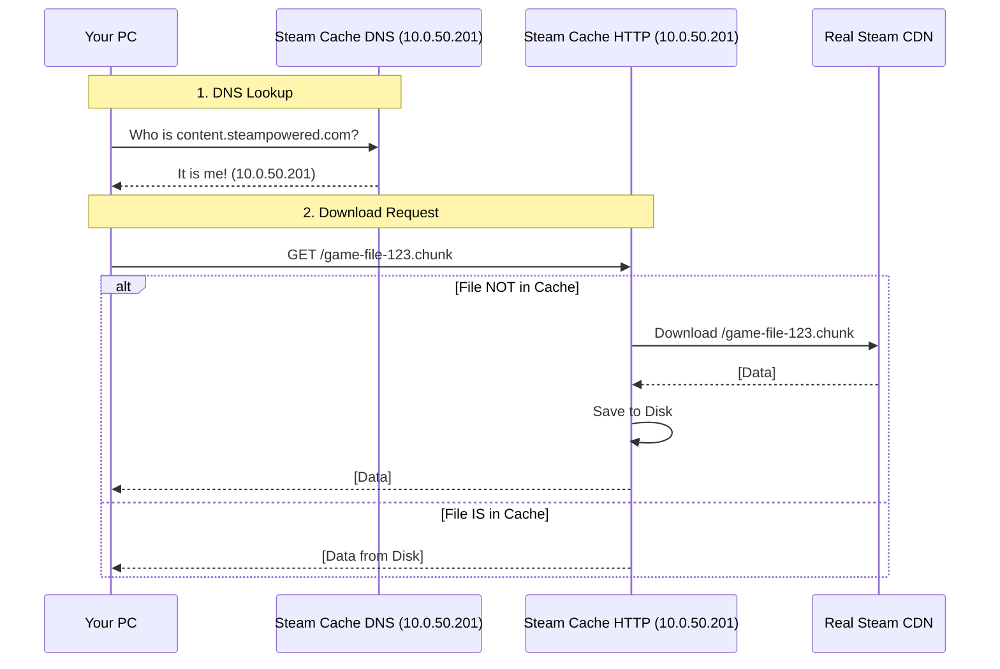

# Steam Cache (LanCache)

A monolithic LanCache deployment to cache game downloads (Steam, Battle.net, Origin, etc.) and serve them at LAN speeds.

Includes a DNS server (`lancache-dns`) to hijack requests for game CDNs and redirect them to the cache.

## Architecture

The deployment consists of two main components sharing a single LoadBalancer IP via MetalLB:

1.  **Steam Cache (Monolithic)**: Nginx cache server (Port 80).
2.  **Steam Cache DNS**: DNS server to resolve game domains to the cache IP (Port 53 UDP/TCP).

### Traffic Flow



## Configuration

### MetalLB Shared IP

Both services use the `metallb.universe.tf/allow-shared-ip` annotation (or matching `externalTrafficPolicy`) to share the VIP `10.0.50.201`.

### DNS Upstream

The `steam-cache-dns` deployment is configured with `UPSTREAM_DNS: 10.0.0.1` to ensure local domains (like `lab.garrettholland.com`) resolve correctly via the pfSense resolver.

## Manual Steps

### pfSense Configuration

To utilize the cache, clients must use `10.0.50.201` as their DNS server.

**Option A: DHCP (Whole Network/VLAN)**

1.  Go to **Services > DHCP Server**.
2.  Select the target interface/VLAN.
3.  Set **DNS Servers** to `10.0.50.201`.

**Option B: DNS Resolver (Specific Domains)**
If you prefer to keep pfSense as the primary DNS:

1.  Go to **Services > DNS Resolver > General Settings**.
2.  Add **Domain Overrides** for known game CDNs (e.g., `steamcontent.com`) pointing to `10.0.50.201`.
    - _Note: This is harder to maintain as the list of domains changes._

## Testing

**Verify DNS Hijack:**

```bash
# Steam
dig @10.0.50.201 steam.cache.lancache.net
# Should return 10.0.50.201

# Blizzard
dig @10.0.50.201 blizzard.cache.lancache.net
# Should return 10.0.50.201
```

**Verify Upstream Resolution:**

```bash
dig @10.0.50.201 google.com
# Should return real IP
```

**Verify Cache Connectivity:**

```bash
curl -v http://10.0.50.201
# Should connect (even if 404 or 500, connection is key)
```

## SteamCMD Client

A separate deployment (`steam-cmd`) is available for prefetching games directly from the cluster.

**Usage:**

```bash
oc exec -it -n steam-cmd deployment/steam-cmd -- /bin/bash
/opt/steamcmd/steamcmd.sh +login anonymous +app_update 740 validate +quit
```
